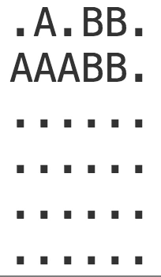

# fillit
___

### School 21

## Description
Fillit is a project who let discover and familiarize  
with a recurring porblematic in programming: searching for  
the optimal solution among a huge set of possibilities.  
`Creating an algorithm which fits some **Tetriminos** together into  
the smallest possible square.`

A **Tetriminos** is a 4-blocks geometric figure that most of you  
might knows thanks to the popular game **Tetris**.

## Example
</img>
